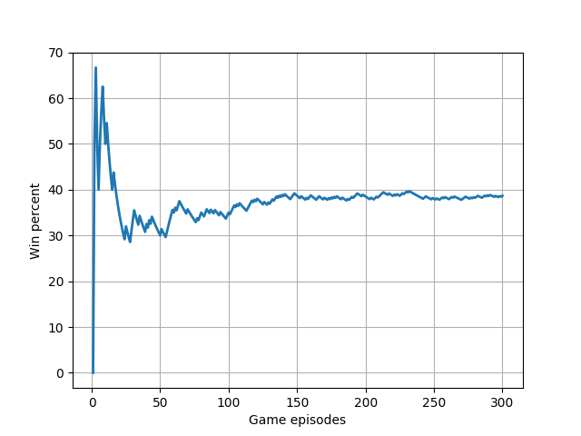
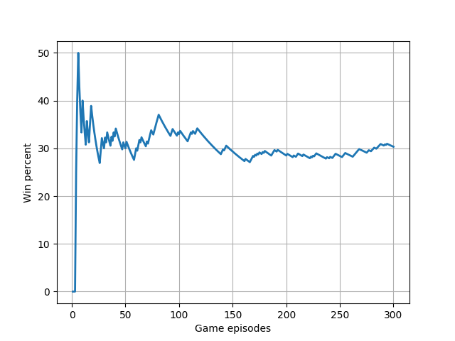
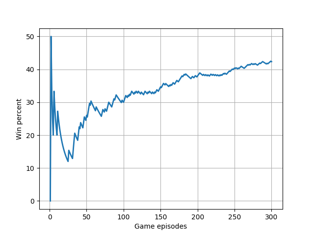

# Java implementation for "Rock Paper Scissors" game.

## Description
Here you can find implementation of the famous game "Rock Paper Scissors".The rules are simple: two opponents simultaneously choose rock, paper, or scissors. Paper beats rock, rock beats scissors, and scissors beats paper.If opponents makes true-random choices the probability of win is equal for all players. However human beings are predictable and there are a lot of different strategies how to win more often.
Three strategies were implemented at this system:

* **Random** Strategy makes random decision without any analysis. This strategy works well on the games with small numbers of episodes (rounds).

* **Chinese** With according to [this investigation](https://arxiv.org/pdf/1404.5199v1.pdf) (made by chinese guys) there are several simple rules: If you win, show at the next time last opponent sign. If you lose, show at the next time, sign which beat last opponent sign. And vise versa if you find out that opponent knows this strategy.

* **Markov chain** This strategy based on ['Markov chains'](https://en.wikipedia.org/wiki/Markov_chain) probabilistic theory. This is a self-learned strategy. It tries to predict an opponent bid, based on  historical data about last games.

This application provides an ability to play files with test data-sets for chosen strategy. And provides an user interface (cli) if you want to play this game against chosen strategy.
Also you can easily implement your own strategies or modify current.

## Run book
You need Java 8 and Maven 3.3.9 or later

### Build
Build the project:
>mvn clean install

### Run user shell
If you want to run a user shell (cli) just execute jar file without any input arguments
>java -jar rps-game-1.0.jar

You can use the following shell-commands:

* Type 'ls' to show all available strategies
* Type 'use [strategy]' to chose strategy and start the game
* Type '\q' to exit
* Type 'stat' to show statistics of current game

All games bets are stored in the log file (game_log_%date%.csv).

### Tests
There are three files with test data-sets. It located at the **'data-sets'** folder

* **test-10.csv** - 10 bids (rows)
* **test-100.csv** - 100 bids (rows)
* **test-300.csv** - 300 bids (rows)

Run jar file with the following parameters:
>java -jar rps-game-1.0.jar -s [strategy] -t [test data-set file path]

Example:
>java -jar rps-game-1.0.jar -s markov -t ../data-sets/test-10.csv

### Test results
This are strategies win percent distributions. It shows how to increase (or decrease) win rate

Random strategy

Chinese strategy

Markov chain strategy

## How to implement your own strategy
If you want to implement your own strategy just write implementation of a 'com.anikulin.rps.core.Strategy' interface and register it at the DefaultStrategyService. What's it!

## Tools
At the 'tools' folder you can find graph.py utility. It helps you to create 'strategies win percent distributions' graphs.

run: 
>python graph.py [game log file]

Before using please install libraries:

>sudo pip instal matplotlib

>sudo pip install csv

